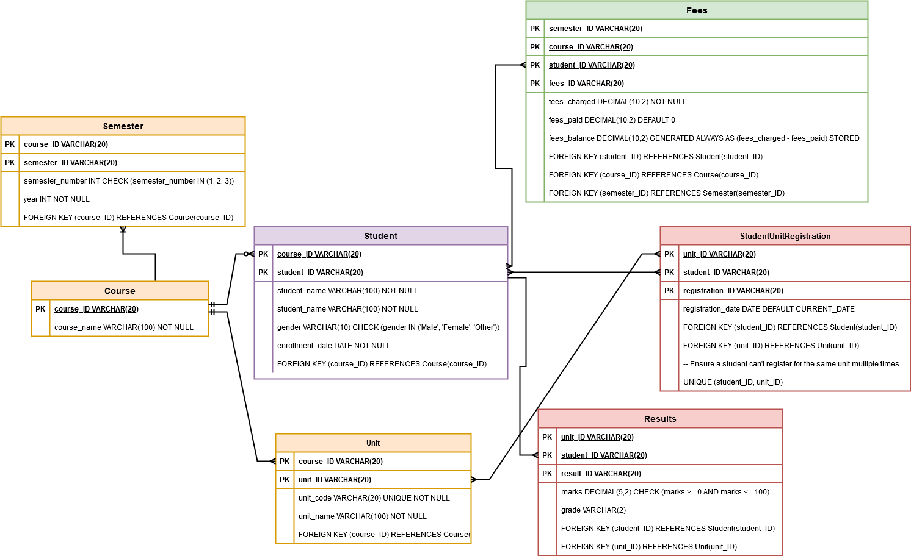

# ICS2404-Advanced-database-systems
Project to tackle CAT given under the unit of Advanced Databases
## The CAT
- Develop a centralized Database (should do the requirement gathering, Develop the ER diagrams and build the actual Database)
- Analyze the management concept against your Database (eg: how scalable is your database, Concurrency control, Recovery concepts) 
- Distribute the database (Use a DBMS that is distributed)
- Using the distributed Database and other sources, create a data warehouse
- Do the data warehouse analysis

## University Student Portal Use Case

### Centralized Database Entities

The centralized database will store the following entities:

#### Student Table:
- **Attributes**: Student ID, Name, Gender, Date Enrolled, Course.
- **Relationships**:
  - A student can only register for one course (1-to-1 relationship).
  - A course can have many students (1-to-many relationship).

#### Course Table:
- **Attributes**: Course ID, Course Name.
- **Relationships**:
  - A course has multiple semesters and units (1-to-many relationship).

#### Semester Table:
- **Attributes**: Semester ID, Semester Number, Year.
- **Relationships**:
  - A course has many semesters (1-to-many relationship).

#### Units Table:
- **Attributes**: Unit ID, Unit Code, Unit Name.
- **Relationships**:
  - A course has multiple units (1-to-many relationship).
  - A student can register for multiple units (many-to-many relationship).

#### Results Table:
- **Attributes**: Student ID, Unit ID, Unit Code, Marks, Grade.
- **Relationships**:
  - Links students to their respective units and grades.

#### Fees Table:
- **Attributes**: Student ID, Fees Charged, Fees Paid, Fees Balance, Course ID, Semester ID.
- **Relationships**:
  - Tracks fees information per student, associated with their course and semester.

---

### The ER diagram

# University Database Overview

- **Tables & Purpose:**
  1. `Course`: Academic programs
  2. `Student`: Student records & enrollment
  3. `Unit`: Course units/subjects
  4. `Results`: Academic performance tracking
  5. `Fees`: Financial records
  6. `Semester`: Academic terms
  7. `StudentUnitRegistration`: Unit enrollment
  8. `Results`: Exam scores/grades

Features: Foreign key relationships, automated grade calculation trigger, data validation constraints (gender, marks range), comprehensive student academic/financial tracking.

### Distributed Database Need

#### Scalability:
- The database must handle thousands of students, faculty, and administrative staff accessing the portal simultaneously for activities such as checking results, viewing fee balances, and semester registration.
- Ability to accommodate the increasing number of courses, units, and students as the university grows.

#### Fault Tolerance:
- Ensure continuous availability of critical services like fee payment status updates, semester registration, and results publication, even in the event of server failures.

#### Data Locality:
- Distribute data across campuses or regional branches for reduced latency, ensuring faster access to data for students and staff in different geographic locations.

#### Regulatory Compliance:
- Ensure sensitive student information complies with data protection laws (e.g., GDPR for international students or similar local regulations).

#### Disaster Recovery:
- Implement distributed backups and replication to recover critical data quickly in case of data center outages or other disruptions.

---

### Data Warehouse Analysis

#### Student Performance Analytics:
- Analyzing trends in grades across courses and units to identify strengths and areas for improvement in teaching methods.
- Tracking individual student progress to provide personalized academic advice.

#### Financial Insights:
- Monitoring fee payment patterns and identifying overdue balances for better financial planning.
- Analyzing the financial burden per course to adjust fees or offer financial aid where necessary.

#### Course and Unit Management:
- Evaluating popular courses and units based on student enrollment data.
- Predicting demand for specific units or courses to optimize resource allocation.

#### Semester Trends:
- Identifying semester-specific trends such as peak registration times or common issues faced by students during reporting periods.

#### Regulatory Reporting:
- Generating comprehensive reports on student enrollment, financial compliance, and academic outcomes for audits and regulatory bodies.

---

### How This Use Case Suits the CAT

#### Centralized Database Development:
- Requirement gathering will involve identifying the needs of students, faculty, and administrators.
- ER diagrams will be created to map relationships between tables such as students, courses, semesters, units, results, and fees.
- A centralized database will be built to house this data initially.

#### Management Concept Analysis:
- **Scalability**: The centralized database's ability to handle an increasing number of students and courses will be evaluated.
- **Concurrency Control**: Mechanisms to handle simultaneous data access (e.g., fee payments and result uploads) will be implemented and analyzed.
- **Recovery**: Backup strategies and recovery options for critical data such as results and fee payments will be outlined.

#### Distributed Database Implementation:
- The database will be distributed using a DBMS (e.g., MongoDB, PostgreSQL) to ensure scalability, fault tolerance, and fast access across different campuses or regions.

#### Data Warehouse Creation:
- Data from the distributed database and other sources (e.g., academic performance reports) will be aggregated into a data warehouse.
- ETL (Extract, Transform, Load) processes will be implemented to transform operational data for analysis.

#### Data Warehouse Analysis:
- The data warehouse will provide insights into student performance, financial patterns, and course management, helping the university make informed decisions and improve operational efficiency.

